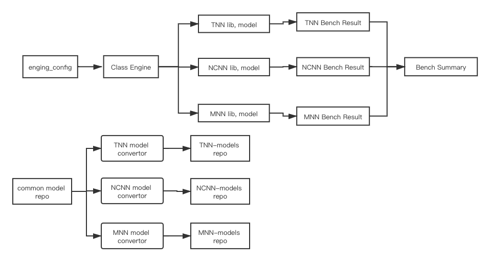

# embedded-ai.bench

  
  


- 一键编译：拉取框架代码，编译库；
- 一键转换：拉取原始模型、编译转换工具、转换模型；
- 一键测速：拉取框架模型，测速。拉取框架模型，框架模型存放于不同的代码仓库中，执行测速过程会自动完成拉取。

## 跑起来

```shell
# tnn
cd ./tnn
./build_tnn_android.sh
cd -

# mnn
cd ./mnn
./build_mnn_android.sh
cd -

# ncnn
cd ./ncnn
./build_ncnn_android.sh
cd -

# bench
python bench.py

# if execution is okay:
# ===> edit ./core/global_config.py
# ===> edit value of `GPU_REPEATS=1000`, `CPU_REPEATS=100`, `WARMUP=20`

# see benchmark result below
# ./tnn/*.csv
# ./mnn/*.csv
# ./ncnn/*.csv

```

目前支持模型有限，见：[tnn-models](https://github.com/AI-performance/tnn-models)、[mnn-models](https://github.com/AI-performance/mnn-models)、[ncnn-models](https://github.com/AI-performance/ncnn-models)。

## bench结果示例

- [mnn bench result demo](https://github.com/AI-performance/embedded-ai.bench/blob/master/docs/bench-demo/mnn-(HEAD%20detached%20at%201.0.0)-0df31a8-android-armv7android-armv8-20200723-221707.bench.csv)
- [ncnn bench result demo](https://github.com/AI-performance/embedded-ai.bench/blob/master/docs/bench-demo/ncnn-master-66c8c7e-android-armv7android-armv8-20200723-221633.bench.csv)
- [tnn bench result demo](https://github.com/AI-performance/embedded-ai.bench/blob/master/docs/bench-demo/tnn-master-2aa6b9f-android-armv7android-armv8-20200723-215922.bench.csv)


## 项目架构

下图描述了本项目的架构:



1. class Engine: 由`engine_config`创建每个框架的实例、加载模型models、编译引擎lib(TODO:待集成到py脚本)，跑出bench结果；
2. BenchSum(TODO): 汇总各Engine实例的Bench结果；
3. common model repo(TODO): 存放公共原始模型的仓库。如Caffe、TensorFlow框架的经典模型(MobileNetV1/V2等)。
    1. 各引擎独立模型仓库，如tnn-models。包含从公共公共模型仓库转换得到的tnn的模型、模型转换器的一键编译脚本(TODO)、模型转换的一键转换脚本(TODO)、模型版本一键刷新到README的脚本；
    2. 各引擎独立模型仓库独立定期更新(TODO)；
    3. 每个Engine实例在执行过程中会拉取各自独立模型仓库的模型，为bench做准备。
    
    
## LICENSE

禁止除AI-Performance开源组织以外的主体，【公开】发布【基于本项目的benchmark结果】，若公开发布则视为侵权，AI-Performance有权追诉法律责任。

AI-Performance开源组织，以中立、公平、公正、公开为组织准则，致力于打造制定AI领域的benchmark标准。
    
    
## 开发须知

首次提交代码需执行以下命令，安装钩子。安装成功后，每次执行`git commit`后会自动检查`.pre-commit-config.yaml`里设定的检查项，如目前是针对Python代码做格式检查。

```shell
# 第一次执行钩子可能会比较慢
pre-commit install

# 若找不到则需要先安装pre-commit
pip install pre-commit

# 如需卸载则执行
pre-commit uninstall
```

如若找不到python3.8，可以安装minconda3，使用如下命令：

```shell
# 自动安装miniconda3，并写入当前用户的环境变量
.github/workflows/pre-commit-job.sh

# 提交代码前先创建一个名为dev_env_py的环境为例，遇到选择y
conda create -n dev_env_py python=3.8

# 激活刚创建的环境
conda activate dev_env_py

# 重新安装pre-commit
pre-commit install
```

> 若CI挂掉，查看[Github Action](https://github.com/AI-performance/embedded-ai.bench/actions)的具体日志，是否由于timeout如`git clone`仓库，这时可以`Re-run this jobs`重新运行。


## 单元测试

```shell
.github/workflows/unit-test-job.sh
```
